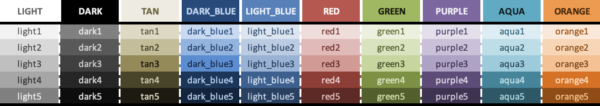

Excelbird
=======================

.. role:: html(raw)
    :format: html

..

  **A markup language, front-end framework, and dataframe library all in one. For Excel.**

----

.. admonition:: Dark Mode :fa:`moon`
   :class: sidebar

   Toggle using the :fa:`sun` on the top right.

Excelbird is the tool for rapid development of Excel workbooks in Python.

**Fluid Layout**: Excelbird is **not** a scripting library. There is no concept of "cell ``A1``", and there
are **no grid coordinates**. Your layout is *fluid*, like an html page.

**Built-in cell references**: Cell references are *created automatically* as excelbird objects reference each other,
and lazily resolve to real cell locations once a workbook is written.

.. grid:: 1

    .. grid-item-card::
        :link: /intro/main
        :link-type: doc

        :doc:`Documentation </intro/main>` :octicon:`arrow-right;1.3em`
        ^^^

Excel theme color grid, in 1 line of code
-------------------------------------------------

.. dropdown:: :octicon:`chevron-left` :octicon:`chevron-right` :html:`&nbsp;&nbsp;&nbsp;` Code

   :ref:`Click here <Excel Theme Color Grid>` for full explanation

   :html:`
`

   .. code-block::

        from excelbird import Book, Frame, Col, Cell, colors

        Book([
            Frame([
                Col(
                    [Cell(f"{color}{i}", fill_color=shades[i]) for i in range(1, len(shades))],
                    header=color.upper(),
                    border=['thick', ('mediumDashed', 'FFFFFF')],
                    header_style=dict(fill_color=shades[0]),
                ) for color, shades in colors.theme_groups.items()
            ])],
            # Styling passed down to children
            row_height=18,
            center=True,
            col_width=11,
            auto_shade_font=True,  # based on background color
            header_style=dict(
                bold=True,
                row_height=26,
                center=True,
                auto_shade_font=True,
                border_left=('thick', 'FFFFFF'),
            ),
        ).write("test.xlsx")

Layout Elements
---------------------------------

.. grid:: 3

    .. grid-item-card::
        :link: /cell/main
        :link-type: doc

        :class:`Cell <excelbird.Cell>`
        ^^^

    .. grid-item-card::
        :link: /series/main
        :link-type: doc

        Series
        ^^^
        :class:`Col <excelbird.Col>` | :class:`Row <excelbird.Row>`

    .. grid-item-card::
        :link: /frame/main
        :link-type: doc

        DataFrame
        ^^^
        :class:`Frame <excelbird.Frame>` | :class:`VFrame <excelbird.VFrame>`

.. grid:: 2

    .. grid-item-card::
        :link: /stack/main
        :link-type: doc

        Container
        ^^^
        :class:`Stack <excelbird.Stack>` | :class:`VStack <excelbird.VStack>`

    .. grid-item-card::
        :link: /workbook/main
        :link-type: doc

        Workbook
        ^^^
        :class:`Sheet <excelbird.Sheet>`, :class:`Book <excelbird.Book>`

Dynamic Elements
-----------------------------------

.. grid:: 2

    .. grid-item-card::
        :link: /gap/main
        :link-type: doc

        :class:`Gap <excelbird.Gap>`
        ^^^

        Apply spacing

    .. grid-item-card::
        :link: /expr/main
        :link-type: doc

        :class:`Expr <excelbird.Expr>`
        ^^^

        Execute code on elements not assigned to variables

    .. grid-item-card::
        :link: /func/main
        :link-type: doc

        :class:`Func <excelbird.Func>`
        ^^^

        Call Excel built-in functions

.. toctree::
   api
